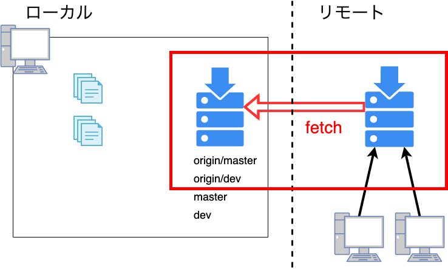
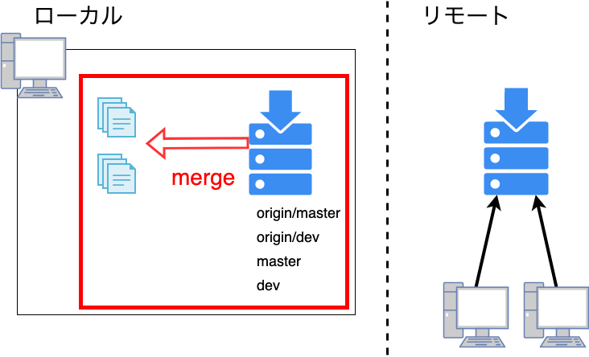

# やったこと
- `git fetch` / `git merge` 説明資料作成
- django のアカウント周りの実装法の調査

---
# Git関連
- git: VCS(Version Control System)の1つ
  - ファイルの変更履歴、タイムラインのような情報を管理するシステム
- リポジトリ: 各バージョン情報を保持しているデータベースのようなもの
  - このバージョンではファイルAを作成、ファイルBのこの行を変更といった情報
  - git の場合はリモートとローカルの2つのリポジトリがある
- ブランチ: 専用の作業スペースのようなもの(ブランチの概念には触れないとのことなので以下適当にスペースと呼ぶ)
  - django_demo プロジェクトならばmaster, devが該当
    - 一般的にスペースAでドキュメントの更新、スペースBで機能追加、といったように作業毎にスペースを作成する
  - 各スペースは独立
- 通常ローカルリポジトリにはoriginと呼ばれるリモートリポジトリーの情報を保持するスペースがある
  - origin/master, origin/dev ← リモートリポジトリの情報を保持
  - master,dev ← ローカルの作業内容

+++
## フェッチ
- リモートリポジトリから最新情報をローカルリポジトリに持ってくるコマンド
- ローカルリポジトリが更新されるだけでファイルは更新されない
　 

+++
## マージ
- 指定したスペースの内容をファイルに反映する
  `git merge <space_name>`
- 同じ箇所を修正したコミットが複数あると競合(コンフリクト)が発生する
  - git はどの修正が正しいのか判断できないため、手動で正しい修正を反映させる必要がある
　 

---
# django のアカウント周りの実装法の調査
- django のクラスを継承したモデルやフォームを作成/使用する独自クラスを設定で明記すれば django がよしなにやってくれるらしい → 実装中
- import などのパス指定や django の permission が理解できておらずよくエラーになるので困っている
